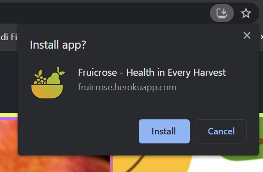
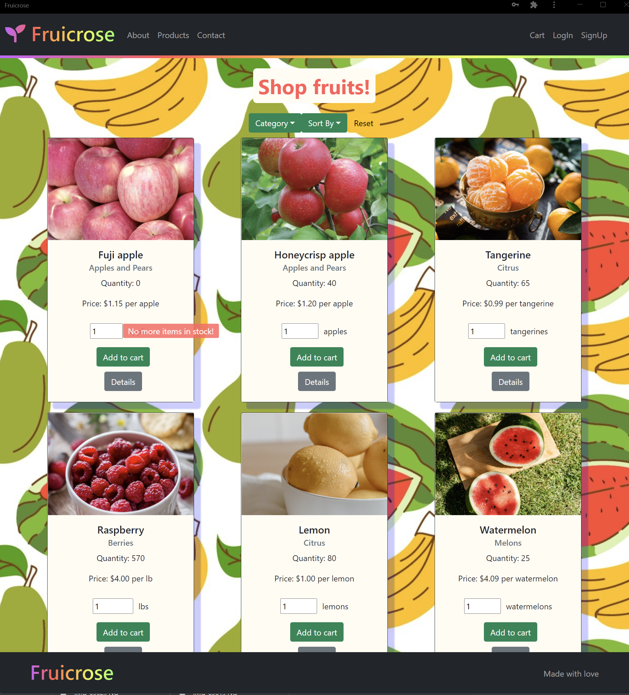
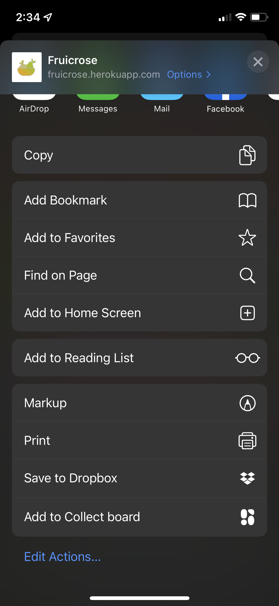
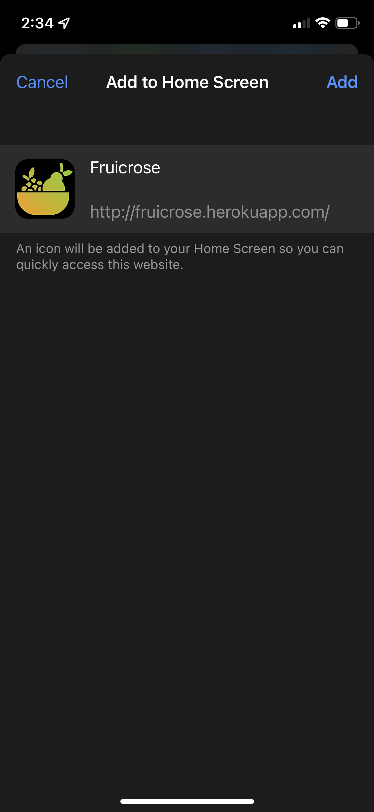

   
  # Fruicrose 
  ## **Description**
  Welcome to Fruicrose, online marketplace allowing fellow produce lovers to bring to fruits into fruition. Shop our latest selection of all the best fruits, create an account and purchase your fruits! As a PWA, integrate it into your mobile device or desktop for a usable offline experience till checkout. Once online, complete your checkout! Purchase all your favorite fruits, from Fruicrose!

   
  ---

  ## **Table of Contents**
  * [Installation](#installation)
    * [Desktop](#desktop)
    * [IOS](#ios)
  * [Usage](#usage)
  * [Credits](#credits)
  * [License(s)](#license)
  * [Contributers](#contributers)
  * [Questions](#questions)
   
  ---

## **Installation**
---
###    **Desktop**
---

Navigate to [http://fruicrose.herokuapp.com/](http://fruicrose.herokuapp.com/). Since the application meets the critieria as a progressive web application, simply select the 'Install Fruicrose - Health in every Harvest' button which is located on the right side of the URL bar.

Confirm the Installation

The application will now appear as an application on your desktop. By default, the application should install on your desktop. 

---
### **IOS**
---

Navigate to [https://fruicrose.herokuapp.com/](https://fruicrose.herokuapp.com/) in your Safari browser. Since the application meets the critieria as a progressive web application, simply select the 'Share Button' button which is located at the very bottom center of your browser.

Once you select the share button, scroll down to the portion of the menu that displays selectable actions, select, 'Add to Home Screen', and confirm the next dialogue box.

The application should appear as your last installed app on IOS. Selecting it will display a clean interface, which persist from the main website itself. 

You now have access to the same information as if directly acessing it from the website. 

## Time to get your fruit on!

---

  ## **Usage**
  To use this application, sign up as a new user if you do not already have an account, otherwise log in. The buttons are located in the top left.

  You can add fruits to your cart by selecting the 'Add to Cart button'. The items will be added to your cart, where you can navigate to from the top left to checkout and purchase your items. It will redirect you to our third-party payment platform, [Stripe](https://stripe.com/), which will process your payment.
  
  On successful payment, the page will be redirected back to Fruicrose to notify you of a successful purchase.

  Past orders may be be seen in your dashboard if you are logged in. 

---   

# **Credits**

  1. Hamzah Ullah - [Github](https://github.com/brobro10000), [Profile](https://brobro10000.github.io/) 
  2. Owen Dupree - [Github](https://github.com/odupree1988), [Profile](https://odupree1988.github.io/Portfolio/)
  3. Luke Hampton- [Github](https://github.com/lukehampton6), [Profile](https://lukehampton6.github.io/)

---

# **Website**

## https://fruicrose.herokuapp.com/
  
---

  ## **License**
  1 license used:
 [MIT](https://choosealicense.com/licenses/mit/)
 

  ---

  ## **Contributers**
   Contributing to the Project is Restricted 

  ---

  ## **Questions?**

  ### **Github**
  [Repository](https://github.com/brobro10000)

  [Personal Page](https://brobro10000.github.io)

  If you have any questions, you can reach me at <hamzahullah@gmail.com>
